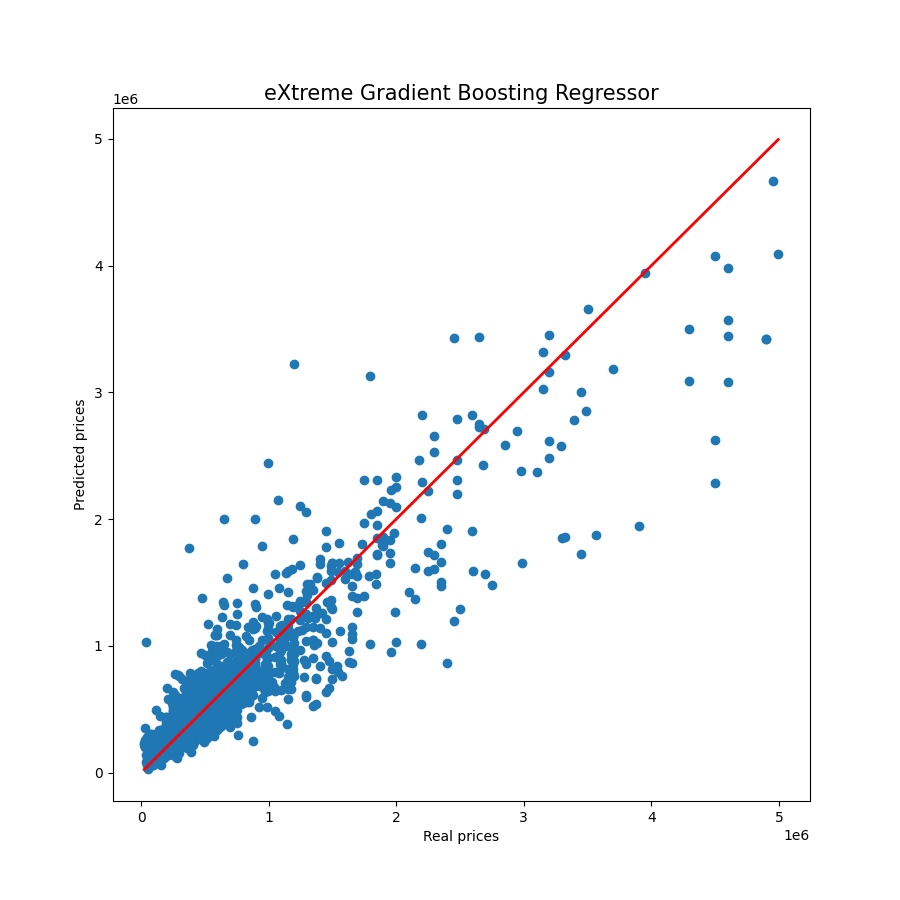
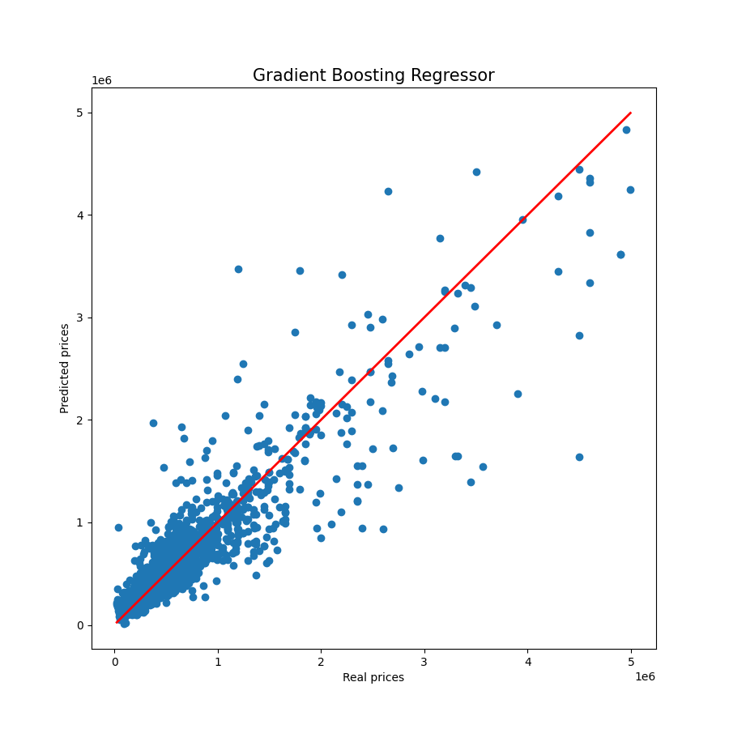
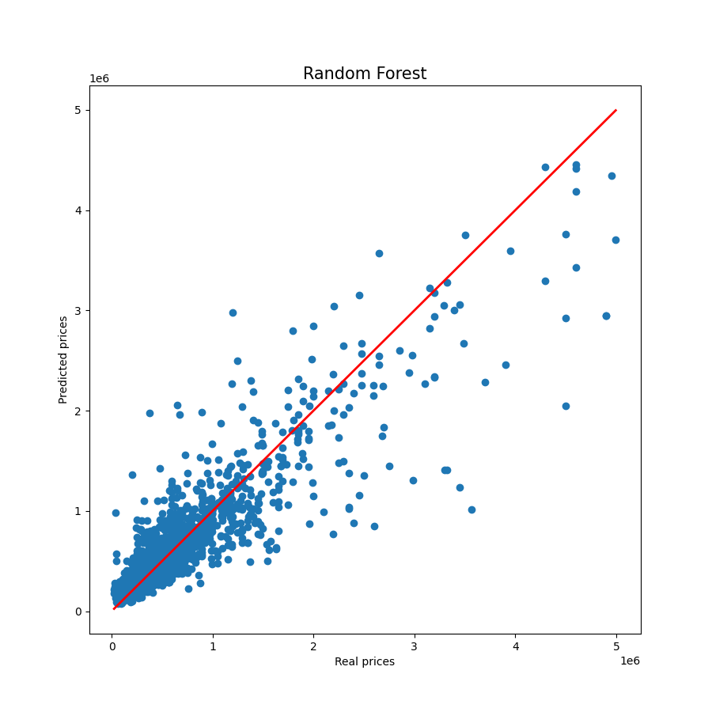
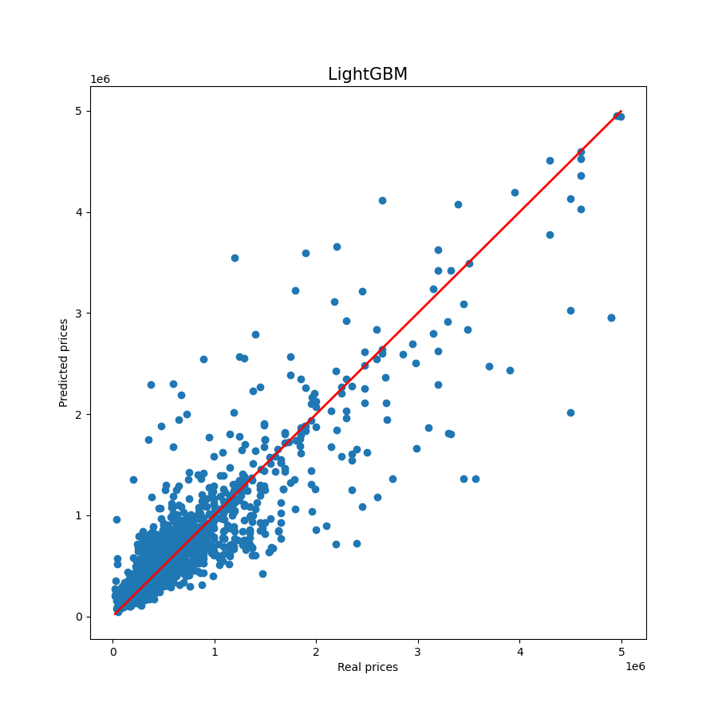
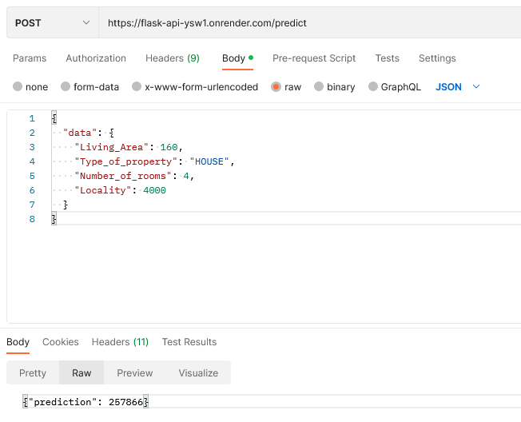

# Real Estate Price Prediction (full project)

This is our first learning project completed at BeCode Liège. The first part (data acquisition) involved team work, while the subsequent parts were personal learning projects.


# Data Acquisition (Part 1) :

## Description :

The goal of this project was to collect information from the [immoweb website](https://www.immoweb.be/en/search/house/for-sale?countries=BE&page=1&orderBy=relevance). We had to gather information about at least 10,000 properties all over Belgium and create a CSV file with the following columns :

Locality, Type of property, Subtype of property, Price, Type of sale, Number of rooms, Living Area, Fully equipped kitchen, Furnished, Open fire, Terrace, Terrace Are, Garden, Garden Area, Surface area of the plot of land, Number of facades, Swimming pool, State of the building.

The dataset had to be clean in the sense of recording only numerical values. 

## Installation :

Please refer to the *requirements.txt* file.

## Structure of the code :

Our program consists of three different parts. The first part of the program is responsible for gathering all the necessary links that will be used for data collection. The second part of the program uses the collected links to scrape information from those webpages. The final step of the program is to "clean" the data that has been collected. This includes removing duplicates and formatting data to have (mainly) numerical values. However, the data is not processed to remove any errors or inconsistencies. 

### 1) Collecting the links :

The aim of the [links_collection.ipynb](./data_acquisition/links_collection.ipynb) file is to collect the links of all houses and apartment for sale on the immoweb website. In practice, the house and apartment sections are done in parallel (using threads) and both are following the same algorithm:

* __first__, The algorithm goes through the 333 pages that are available.
* __then__, scrapes these pages to get all the links it contains.
* __lastly__, This part creates a csv file called [links.csv](./data_acquisition/links.csv) which stores all the links collected.

### 2) Scraping all the links :

For all the links that are stored in the links.csv file, [house_scrapping.ipynb](./data_acquisition/house_scrapping.ipynb) will:

* Open the link
* Scrape the available information


* store all the collected information into different csv files called all_info_TeamMember1_1-5000.csv, all_info_TeamMember1_1-10000.csv, all_info_TeamMember2_10000-15000.csv, etc. These files will be merged in the next step of the program.

In this csv file, each line represents a new house/apartment. The column names are given in the Description section. In this part a special type of multithreading was implemented, which is called teamwork: 

- pip install nicePeople

- from nicePeople import teamwork 

We have splitted the links (20000 in total) in three to collect the information in parallel. The reason for this was to minimize the risk of being blocked by the immoweb website if we'd have used 'real' concurrency. 

### 3) Cleaning the data :

In this last part [merge_and_clean_data.ipynb](./data_acquisition/merge_and_clean_data.ipynb) we will merge all the csv files from the previous part. The dataframe is not clean yet. We only want to retrieve numerical values. So this part of code will include a mapping which is explained in the 'usage' of this 'readme' file.

## Usage :

### 1) Collecting the data :

You can use any WebDriver through Selenium to get and extract the URL of each page. The Firefox WebDriver was used in this project with an additional option (headless) which doesn't show the process of opening and closing the pages. 

In order to collect the links of all houses and apartments for sale, we had a look on the website of immoweb and found 333 pages for each property type. This is something you need to check and change manually when running the program. You can also add an additional variable 'end_pagenumber' and scrape this information from the website. 

This workprocess will take about 1 hour. 

### 2) Scraping all the links :

To scrape each propertylink we have parsed the HTML website using BeautifulSoup library. We saw that the information was under a "script" with type "text/javascript" and that property items could be found in "window_classified".


We converted the needed information into a Python dictionary using JSON. 

This (shared) workprocess can take up to 4 hours when divided between two or more computers. When there's a problem while running, the code will store the scraped information under a CSV file. The program will continue working with a new CSV file. You can add your name to distinguish between team members.


This will of course cause an additional task to merge all the CSV files. The [merge_and_clean_data.ipynb](./data_acquisition/merge_and_clean_data.ipynb) will execute this for you. 

### 3) Cleaning the data :

The function 'create_df' will merge all the csv files into a single dataframe. This dataframe will have non-numerical values. In order to get only numerical values we have written the function clean_df. This part of the code will replace string values by numerical values (using mapping).

## Visuals :

In this part we would like to illustrate the output of this program. 

We can see that the dataframe consists only of numerical values like required. We can see that the data is (almost) evenly distributed between the two property types (house/apartment) as we see from the pie chart below:


---

# Data Analysis (Part 2) :

## Description :

The goal of this part is to visualise the collected data with visualisation tools.

For this part we will use :

- See requirements.txt

The data obtained with the "merge_and_clean.ipynb" notebook was a bit too "cleaned", some values was replaced with numericals values and this complicates the visualisation process.

Therefore, a new "merge_and_process_data.ipynb" notebook was made to have more flexibility later on with the data.

The .csv file obtained is then used inside the "data_visualisation.ipynb" notebook to do the visualisation.

At first, we import the file and do some cleaning and adding some colums :

```python
# Drop Unnamed columns from the dataframe
df.drop("Unnamed: 0", axis=1, inplace=True)
df.drop("Unnamed: 0.1", axis=1, inplace=True)

#Fill specific columns NaNs with 0
df["Terrace"].fillna(value=0, inplace=True)
df["Terrace_Area"].fillna(value=0, inplace=True)
df["Garden"].fillna(value=0, inplace=True)
df["Garden_Area"].fillna(value=0, inplace=True)

#Convert bool type colums to 0 and 1
df = df.replace({"Furnished": {False: 0, True: 1}})
df = df.replace({"Open_fire": {False: 0, True: 1}})
df = df.replace({"Terrace": {False: 0, True: 1}})
df = df.replace({"Garden": {False: 0, True: 1}})
df = df.replace({"Swimming_pool": {False: 0, True: 1}})

#Add two columns with the calculated price/m2 for living area alone and the whole surface area of the plot of land
df["price_living_sqm2"] = df["Price"] / df["Living_Area"]
df["price_plot_sqm2"] = df["Price"] / df["Surface_area_of_the_plot_of_land"]
```

## Visuals :

We print an histogram of prices, we see that most price are around 250000€ :


We use a correlation matrix, this will be usefull later for feature selection for machine learning :


We compare property subtypes, we see that the kot (student bedsits) are the most expensive ones ! Lowest median value are in "farmhouse" subtype :


---

# Data Modeling (Part 3) :

## Description :

The goal of this part is to create a machine learning model with the datas using different regressor and compare the results.

For this part we will use :

- See requirements.txt

## Preprocessing :

First, we load the all_infos_processed.csv file and we use dictionnaries to replace the categorical values with numbers (starting from 1).

This process is ok when we are using models that rely on rules, like decisions trees, otherwise it's better to use different method of preprocessing like onehot encoder in Sklearn or dummies in Pandas.

Then, we drop missing values in "Price" column as we cannot use empty targets to train our model.

We don't use feature scaling, as it wasn't mandatory for decision trees based algos, and the gain of accuracy was negligible during testing.

Finally, we fill the remaining NaNs with 0, Imputer was tried but with no score improvement either.

## Feature selection :

MLJAR was used for this task on another Jupyter notebook, based on the results we select the following features :

* Living_Area

* Locality

* Surface_area_of_the_plot_of_land

* Number_of_rooms

* Type_of_property

* Subtype_of_property

* State_of_the_building

* Terrace_Area

* Garden_Area

* Fully_equipped_kitchen

* Swimming_pool

* Number_of_facades

## Model selection :

We select :

* XGBoost

* GradientBoostingRegressor (SKlearn)

* RandomForestRegressor (SKlearn)

* LightGBM

## Hyperparameter tuning :

We use MLJAR to fine-tune the parameters using the "Optuna" mode, and also GridSearchCV.

We also select only rows with prices between 10k and 5M€, to remove some outliers that was impacting the accuracy.

## Score :

| Model         | R2     | MAPE   | MAE    | RMSE   | Runtime |
| ------------- | ------ | ------ | ------ | ------ | ------- |
| XGBoost       | 84.72% | 23.24% | 96677  | 196636 | 2.4sec  |
| GradientBoost | 83.83% | 22.73% | 95257  | 202287 | 16.5sec |
| RandomForest  | 81.75% | 24.92% | 102209 | 214856 | 3.3sec  |
| LightGBM      | 80.87% | 23.67% | 99088  | 220002 | 2.3sec  |

As we can see, XGBoost is the best for R2, but if we look at MAPE, GradientBoost is a bit better than XGBoost.

XGBoost is a lot faster than GradientBoost, this is a real advantage in some situations (large datasets for example) that should be taken into account.

Some tests was also made by separating House and Appartment for training the model, the model was slightly better on Appartment category, due to less variation in features than in House category.

## Visuals :

We also make some visuals to plot the Real prices vs Predicted prices for each models.









---

# Deployment (Part 4) :

## Description :

The goal of this part is to give a way to the user to obtain a prediction with our model.

For this part we will use :

- See deployment/requirements.txt

## Access :

The service is an API accessible at this url : https://flask-api-ysw1.onrender.com

The base url return "Alive !" when the server is up and running.

The /predict" endpoint with POST method is used to make a prediction : https://flask-api-ysw1.onrender.com/predict

PS : Render free services can take some time to load after a period of inactivity, i have seen up to 1min of delay for the first request, so please click on the base url first and wait for the "Alive !" response, then you are good to go !

## Data format :

The POST request should be made with this json format ("HOUSE" or "APARTMENT" can be used for "Type_of_property", but if the string is empty, "House" will be used by default), all fields/values are mandatory :

```json
{
  "data": {
    "Living_Area": 160,
    "Type_of_property": "HOUSE",
    "Number_of_rooms": 4,
    "Locality": 4000
  }
}
```

The previous request is for a house with 160m² of living area and 4 rooms, at Liège (4000).

The json output is as follow, the predicted price is an integer :

```json
{"prediction": 257866}
```

Here is a screenshot of a test done with Postman, everything works as expected :



## Deploy on render :

A dedicated requirements.txt and a Dockerfile was created to be able to build/deploy the API on render, they are available in the /deployment folder.

This part with Docker and render was quite challenging, and after many trial and error and thus so much time wasted, among other things I realized that Scikit-learn was needed for xgboost to work, so it was added to the deployment/requirements.txt file.

---
